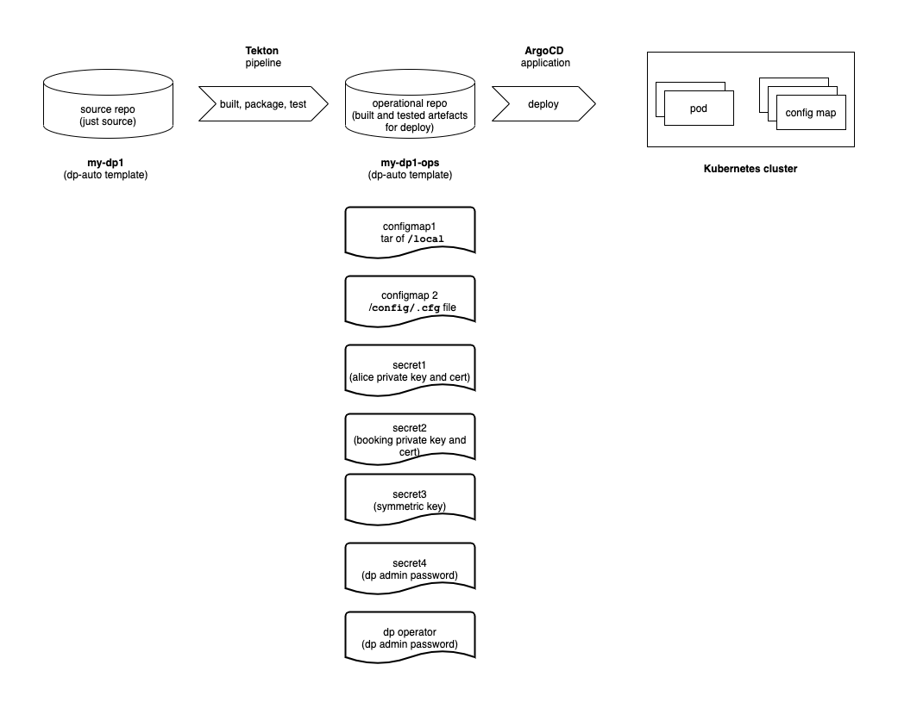

# IBM MQ automation pipelines

This repository can be used to automate the build, test and deploy of your
Queue manager to OpenShift Kubernetes.

## Overview

This branch contains the pipelines for the following diagram:

## Install Tekton

- for first pass, install manually
- medium term install via ArgoCD app
- might be best to have ArgoCD app in `mq01-ops` repo?
  - or is it best to install Tekton manually and
  - have a pipeline that installs ArgoCD in mq01-ops repo?
  - the advantage of this is one starting point; source repo and pipelines...

## Install ArgoCD

- medium term, would be better to install ArgoCD first, then
- install Tekton with ArgoCD app

